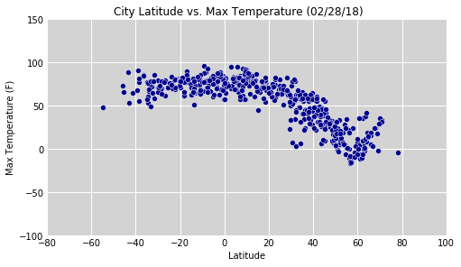
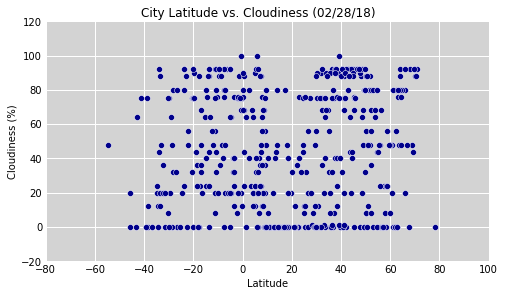

```python
##### WeatherPY ######
import random
import sys
import math
from citipy import citipy
import openweathermapy.core as ow
import pandas as pd
import io
import requests
import os
import matplotlib.pyplot as plt
from datetime import datetime
import seaborn as sns

answer = input('Please Enter number of plots -->')
number_of_plots = int(answer)
# This csv file read into a list is used to limit the number of failed "gets" on weather data 
# by making sure the city out of citipy is also in this list before being added to the get list
csv_path = os.path.join("weathermapy.csv") 
weather_cities_df = pd.read_csv(csv_path)
weather_city_names = weather_cities_df['nm']
weather_cities = weather_city_names.tolist()

# Randomly generate lat and long coordinates
radius = 10000000                         #Choose your own radius
radiusInDegrees=radius/111300            
r = radiusInDegrees
x0 = 0.00
y0 = 0.00
city_list = []
city_count = 0
for i in range(1,2000):                 #Choose number of Lat Long to be generated
    u = float(random.uniform(0.0,1.0))
    v = float(random.uniform(0.0,1.0))
    w = r * math.sqrt(u)
    t = 2 * math.pi * v
    x = w * math.cos(t) 
    y = w * math.sin(t)
    xLat  = x + x0
    yLong = y + y0
    
    # from citipy find nearest city to the random coordinates
    city = citipy.nearest_city(xLat, yLong)
    city_name = city.city_name.title()
    
    # if not duplicate (already in city_list) and city in open weather mapy 
    if city_name not in city_list and city_name in weather_cities: 
        # print(city_name)
        # print("xlat = " + str(xLat) + " ylong = " + str(yLong))
        city_list.append(city_name)
        city_count += 1
        if city_count == (number_of_plots + 50): # allow extra for any failed gets 
            break

# Set up items to be used for getting the city and what columns need to be returned
api_key = "25bc90a1196e6f153eece0bc0b0fc9eb"
settings = {"units": "imperial", "appid": api_key}
summary = ["clouds.all", "sys.country", "dt", "main.humidity", "coord.lat", "coord.lon", "main.temp_max", "wind.speed"]
weather_data = []
weather_list = []
count = 0

# loop through the cities list and try to get weather date for each 
for city in city_list:
    try:
        weather_data = weather_data + [ow.get_current(city, **settings)]
        count +=1
        print("Processing Record " + str(count) + " of " + str(number_of_plots) + " | " + city)
        print("ow.get_current(city ='" + city + "', units='" + settings["units"] + "', APPID='" + settings["appid"] + "')")
        #print('http://api.openweathermap.org/data/2.5/weather?appid={}&q={}&units=Imperial'.format(api_key, city))
        weather_list.append(city)
        # exit after after reaching number_of_plots
        if len(weather_list) == number_of_plots:
            break
    except Exception as e:  # for failed gets display city and error message
        print("Skipped " + city + " " + str(e))
        
data = [response(*summary) for response in weather_data]
print("----------------------------- \nData Retrieval Complete \n-----------------------------")
```

    Please Enter number of plots -->500
    Processing Record 1 of 500 | Tandalti
    ow.get_current(city ='Tandalti', units='imperial', APPID='25bc90a1196e6f153eece0bc0b0fc9eb')
    Processing Record 2 of 500 | Cape Town
    ow.get_current(city ='Cape Town', units='imperial', APPID='25bc90a1196e6f153eece0bc0b0fc9eb')
    Processing Record 3 of 500 | Victoria
    ow.get_current(city ='Victoria', units='imperial', APPID='25bc90a1196e6f153eece0bc0b0fc9eb')
    Processing Record 4 of 500 | Behshahr
    ow.get_current(city ='Behshahr', units='imperial', APPID='25bc90a1196e6f153eece0bc0b0fc9eb')
    Processing Record 5 of 500 | Laguna
    ow.get_current(city ='Laguna', units='imperial', APPID='25bc90a1196e6f153eece0bc0b0fc9eb')
    Processing Record 6 of 500 | Sayan
    ow.get_current(city ='Sayan', units='imperial', APPID='25bc90a1196e6f153eece0bc0b0fc9eb')
    Processing Record 7 of 500 | Santa Maria
    ow.get_current(city ='Santa Maria', units='imperial', APPID='25bc90a1196e6f153eece0bc0b0fc9eb')
    Processing Record 8 of 500 | Jalingo
    ow.get_current(city ='Jalingo', units='imperial', APPID='25bc90a1196e6f153eece0bc0b0fc9eb')
    Processing Record 9 of 500 | Scarborough
    ow.get_current(city ='Scarborough', units='imperial', APPID='25bc90a1196e6f153eece0bc0b0fc9eb')
    Processing Record 10 of 500 | Vila Velha
    ow.get_current(city ='Vila Velha', units='imperial', APPID='25bc90a1196e6f153eece0bc0b0fc9eb')
    Processing Record 11 of 500 | Sao Sepe
    ow.get_current(city ='Sao Sepe', units='imperial', APPID='25bc90a1196e6f153eece0bc0b0fc9eb')
    Processing Record 12 of 500 | Namibe
    ow.get_current(city ='Namibe', units='imperial', APPID='25bc90a1196e6f153eece0bc0b0fc9eb')
    Processing Record 13 of 500 | Hamilton
    ow.get_current(city ='Hamilton', units='imperial', APPID='25bc90a1196e6f153eece0bc0b0fc9eb')
    Processing Record 14 of 500 | Lagoa
    ow.get_current(city ='Lagoa', units='imperial', APPID='25bc90a1196e6f153eece0bc0b0fc9eb')
    Processing Record 15 of 500 | Abu Dhabi
    ow.get_current(city ='Abu Dhabi', units='imperial', APPID='25bc90a1196e6f153eece0bc0b0fc9eb')
    Skipped Andenes HTTP Error 404: Not Found
    Processing Record 16 of 500 | Eyl
    ow.get_current(city ='Eyl', units='imperial', APPID='25bc90a1196e6f153eece0bc0b0fc9eb')
    Processing Record 17 of 500 | Nova Vicosa
    ow.get_current(city ='Nova Vicosa', units='imperial', APPID='25bc90a1196e6f153eece0bc0b0fc9eb')
    Processing Record 18 of 500 | Port Alfred
    ow.get_current(city ='Port Alfred', units='imperial', APPID='25bc90a1196e6f153eece0bc0b0fc9eb')
    Processing Record 19 of 500 | Calvinia
    ow.get_current(city ='Calvinia', units='imperial', APPID='25bc90a1196e6f153eece0bc0b0fc9eb')
    Processing Record 20 of 500 | Bredasdorp
    ow.get_current(city ='Bredasdorp', units='imperial', APPID='25bc90a1196e6f153eece0bc0b0fc9eb')
    Processing Record 21 of 500 | Saint-Philippe
    ow.get_current(city ='Saint-Philippe', units='imperial', APPID='25bc90a1196e6f153eece0bc0b0fc9eb')
    Processing Record 22 of 500 | Hermanus
    ow.get_current(city ='Hermanus', units='imperial', APPID='25bc90a1196e6f153eece0bc0b0fc9eb')
    Processing Record 23 of 500 | Georgetown
    ow.get_current(city ='Georgetown', units='imperial', APPID='25bc90a1196e6f153eece0bc0b0fc9eb')
    Processing Record 24 of 500 | Longyearbyen
    ow.get_current(city ='Longyearbyen', units='imperial', APPID='25bc90a1196e6f153eece0bc0b0fc9eb')
    Processing Record 25 of 500 | Kissamos
    ow.get_current(city ='Kissamos', units='imperial', APPID='25bc90a1196e6f153eece0bc0b0fc9eb')
    Processing Record 26 of 500 | Hithadhoo
    ow.get_current(city ='Hithadhoo', units='imperial', APPID='25bc90a1196e6f153eece0bc0b0fc9eb')
    Processing Record 27 of 500 | Havre-Saint-Pierre
    ow.get_current(city ='Havre-Saint-Pierre', units='imperial', APPID='25bc90a1196e6f153eece0bc0b0fc9eb')
    Processing Record 28 of 500 | Caiaponia
    ow.get_current(city ='Caiaponia', units='imperial', APPID='25bc90a1196e6f153eece0bc0b0fc9eb')
    Processing Record 29 of 500 | Troyes
    ow.get_current(city ='Troyes', units='imperial', APPID='25bc90a1196e6f153eece0bc0b0fc9eb')
    Processing Record 30 of 500 | Camacha
    ow.get_current(city ='Camacha', units='imperial', APPID='25bc90a1196e6f153eece0bc0b0fc9eb')
    Processing Record 31 of 500 | Kefalos
    ow.get_current(city ='Kefalos', units='imperial', APPID='25bc90a1196e6f153eece0bc0b0fc9eb')
    Processing Record 32 of 500 | Sao Filipe
    ow.get_current(city ='Sao Filipe', units='imperial', APPID='25bc90a1196e6f153eece0bc0b0fc9eb')
    Processing Record 33 of 500 | Kashira
    ow.get_current(city ='Kashira', units='imperial', APPID='25bc90a1196e6f153eece0bc0b0fc9eb')
    Processing Record 34 of 500 | Oshikango
    ow.get_current(city ='Oshikango', units='imperial', APPID='25bc90a1196e6f153eece0bc0b0fc9eb')
    Processing Record 35 of 500 | Klaksvik
    ow.get_current(city ='Klaksvik', units='imperial', APPID='25bc90a1196e6f153eece0bc0b0fc9eb')
    Processing Record 36 of 500 | Jamestown
    ow.get_current(city ='Jamestown', units='imperial', APPID='25bc90a1196e6f153eece0bc0b0fc9eb')
    Processing Record 37 of 500 | Maceio
    ow.get_current(city ='Maceio', units='imperial', APPID='25bc90a1196e6f153eece0bc0b0fc9eb')
    Processing Record 38 of 500 | Oistins
    ow.get_current(city ='Oistins', units='imperial', APPID='25bc90a1196e6f153eece0bc0b0fc9eb')
    Processing Record 39 of 500 | Sayyan
    ow.get_current(city ='Sayyan', units='imperial', APPID='25bc90a1196e6f153eece0bc0b0fc9eb')
    Processing Record 40 of 500 | Ponta Delgada
    ow.get_current(city ='Ponta Delgada', units='imperial', APPID='25bc90a1196e6f153eece0bc0b0fc9eb')
    Processing Record 41 of 500 | Chachapoyas
    ow.get_current(city ='Chachapoyas', units='imperial', APPID='25bc90a1196e6f153eece0bc0b0fc9eb')
    Processing Record 42 of 500 | Nizwa
    ow.get_current(city ='Nizwa', units='imperial', APPID='25bc90a1196e6f153eece0bc0b0fc9eb')
    Processing Record 43 of 500 | Alausi
    ow.get_current(city ='Alausi', units='imperial', APPID='25bc90a1196e6f153eece0bc0b0fc9eb')
    Processing Record 44 of 500 | Cayenne
    ow.get_current(city ='Cayenne', units='imperial', APPID='25bc90a1196e6f153eece0bc0b0fc9eb')
    Processing Record 45 of 500 | East London
    ow.get_current(city ='East London', units='imperial', APPID='25bc90a1196e6f153eece0bc0b0fc9eb')
    Processing Record 46 of 500 | Saldanha
    ow.get_current(city ='Saldanha', units='imperial', APPID='25bc90a1196e6f153eece0bc0b0fc9eb')
    Processing Record 47 of 500 | Rodez
    ow.get_current(city ='Rodez', units='imperial', APPID='25bc90a1196e6f153eece0bc0b0fc9eb')
    Processing Record 48 of 500 | Chuy
    ow.get_current(city ='Chuy', units='imperial', APPID='25bc90a1196e6f153eece0bc0b0fc9eb')
    Processing Record 49 of 500 | Ilulissat
    ow.get_current(city ='Ilulissat', units='imperial', APPID='25bc90a1196e6f153eece0bc0b0fc9eb')
    Processing Record 50 of 500 | Masuguru
    ow.get_current(city ='Masuguru', units='imperial', APPID='25bc90a1196e6f153eece0bc0b0fc9eb')
    Processing Record 51 of 500 | Souillac
    ow.get_current(city ='Souillac', units='imperial', APPID='25bc90a1196e6f153eece0bc0b0fc9eb')
    Processing Record 52 of 500 | Sur
    ow.get_current(city ='Sur', units='imperial', APPID='25bc90a1196e6f153eece0bc0b0fc9eb')
    Processing Record 53 of 500 | Minas
    ow.get_current(city ='Minas', units='imperial', APPID='25bc90a1196e6f153eece0bc0b0fc9eb')
    Processing Record 54 of 500 | Luderitz
    ow.get_current(city ='Luderitz', units='imperial', APPID='25bc90a1196e6f153eece0bc0b0fc9eb')
    Processing Record 55 of 500 | Hualmay
    ow.get_current(city ='Hualmay', units='imperial', APPID='25bc90a1196e6f153eece0bc0b0fc9eb')
    Processing Record 56 of 500 | Comodoro Rivadavia
    ow.get_current(city ='Comodoro Rivadavia', units='imperial', APPID='25bc90a1196e6f153eece0bc0b0fc9eb')
    Processing Record 57 of 500 | Chimichagua
    ow.get_current(city ='Chimichagua', units='imperial', APPID='25bc90a1196e6f153eece0bc0b0fc9eb')
    Processing Record 58 of 500 | Ushuaia
    ow.get_current(city ='Ushuaia', units='imperial', APPID='25bc90a1196e6f153eece0bc0b0fc9eb')
    Processing Record 59 of 500 | Porto Seguro
    ow.get_current(city ='Porto Seguro', units='imperial', APPID='25bc90a1196e6f153eece0bc0b0fc9eb')
    Processing Record 60 of 500 | Raichur
    ow.get_current(city ='Raichur', units='imperial', APPID='25bc90a1196e6f153eece0bc0b0fc9eb')
    Processing Record 61 of 500 | Batticaloa
    ow.get_current(city ='Batticaloa', units='imperial', APPID='25bc90a1196e6f153eece0bc0b0fc9eb')
    Processing Record 62 of 500 | Bilma
    ow.get_current(city ='Bilma', units='imperial', APPID='25bc90a1196e6f153eece0bc0b0fc9eb')
    Processing Record 63 of 500 | Bonavista
    ow.get_current(city ='Bonavista', units='imperial', APPID='25bc90a1196e6f153eece0bc0b0fc9eb')
    Processing Record 64 of 500 | Carupano
    ow.get_current(city ='Carupano', units='imperial', APPID='25bc90a1196e6f153eece0bc0b0fc9eb')
    Processing Record 65 of 500 | Doha
    ow.get_current(city ='Doha', units='imperial', APPID='25bc90a1196e6f153eece0bc0b0fc9eb')
    Processing Record 66 of 500 | Maxixe
    ow.get_current(city ='Maxixe', units='imperial', APPID='25bc90a1196e6f153eece0bc0b0fc9eb')
    Processing Record 67 of 500 | Kruisfontein
    ow.get_current(city ='Kruisfontein', units='imperial', APPID='25bc90a1196e6f153eece0bc0b0fc9eb')
    Processing Record 68 of 500 | Takoradi
    ow.get_current(city ='Takoradi', units='imperial', APPID='25bc90a1196e6f153eece0bc0b0fc9eb')
    Processing Record 69 of 500 | Tamandare
    ow.get_current(city ='Tamandare', units='imperial', APPID='25bc90a1196e6f153eece0bc0b0fc9eb')
    Processing Record 70 of 500 | Abha
    ow.get_current(city ='Abha', units='imperial', APPID='25bc90a1196e6f153eece0bc0b0fc9eb')
    Processing Record 71 of 500 | Kitui
    ow.get_current(city ='Kitui', units='imperial', APPID='25bc90a1196e6f153eece0bc0b0fc9eb')
    Processing Record 72 of 500 | Salamiyah
    ow.get_current(city ='Salamiyah', units='imperial', APPID='25bc90a1196e6f153eece0bc0b0fc9eb')
    Processing Record 73 of 500 | Havelock
    ow.get_current(city ='Havelock', units='imperial', APPID='25bc90a1196e6f153eece0bc0b0fc9eb')
    Processing Record 74 of 500 | Saint-Francois
    ow.get_current(city ='Saint-Francois', units='imperial', APPID='25bc90a1196e6f153eece0bc0b0fc9eb')
    Processing Record 75 of 500 | Skibbereen
    ow.get_current(city ='Skibbereen', units='imperial', APPID='25bc90a1196e6f153eece0bc0b0fc9eb')
    Processing Record 76 of 500 | Ribeira Grande
    ow.get_current(city ='Ribeira Grande', units='imperial', APPID='25bc90a1196e6f153eece0bc0b0fc9eb')
    Processing Record 77 of 500 | Kashary
    ow.get_current(city ='Kashary', units='imperial', APPID='25bc90a1196e6f153eece0bc0b0fc9eb')
    Processing Record 78 of 500 | Joshimath
    ow.get_current(city ='Joshimath', units='imperial', APPID='25bc90a1196e6f153eece0bc0b0fc9eb')
    Processing Record 79 of 500 | Surt
    ow.get_current(city ='Surt', units='imperial', APPID='25bc90a1196e6f153eece0bc0b0fc9eb')
    Processing Record 80 of 500 | Guarapari
    ow.get_current(city ='Guarapari', units='imperial', APPID='25bc90a1196e6f153eece0bc0b0fc9eb')
    Processing Record 81 of 500 | Visby
    ow.get_current(city ='Visby', units='imperial', APPID='25bc90a1196e6f153eece0bc0b0fc9eb')
    Processing Record 82 of 500 | Ambilobe
    ow.get_current(city ='Ambilobe', units='imperial', APPID='25bc90a1196e6f153eece0bc0b0fc9eb')
    Processing Record 83 of 500 | Parnamirim
    ow.get_current(city ='Parnamirim', units='imperial', APPID='25bc90a1196e6f153eece0bc0b0fc9eb')
    Processing Record 84 of 500 | Verkhniy Rohachyk
    ow.get_current(city ='Verkhniy Rohachyk', units='imperial', APPID='25bc90a1196e6f153eece0bc0b0fc9eb')
    Processing Record 85 of 500 | Mana
    ow.get_current(city ='Mana', units='imperial', APPID='25bc90a1196e6f153eece0bc0b0fc9eb')
    Processing Record 86 of 500 | Mahebourg
    ow.get_current(city ='Mahebourg', units='imperial', APPID='25bc90a1196e6f153eece0bc0b0fc9eb')
    Processing Record 87 of 500 | Rakiv Lis
    ow.get_current(city ='Rakiv Lis', units='imperial', APPID='25bc90a1196e6f153eece0bc0b0fc9eb')
    Processing Record 88 of 500 | Saint-Pierre
    ow.get_current(city ='Saint-Pierre', units='imperial', APPID='25bc90a1196e6f153eece0bc0b0fc9eb')
    Processing Record 89 of 500 | Saint-Gaudens
    ow.get_current(city ='Saint-Gaudens', units='imperial', APPID='25bc90a1196e6f153eece0bc0b0fc9eb')
    Processing Record 90 of 500 | Cidreira
    ow.get_current(city ='Cidreira', units='imperial', APPID='25bc90a1196e6f153eece0bc0b0fc9eb')
    Processing Record 91 of 500 | Am Timan
    ow.get_current(city ='Am Timan', units='imperial', APPID='25bc90a1196e6f153eece0bc0b0fc9eb')
    Processing Record 92 of 500 | Vestmannaeyjar
    ow.get_current(city ='Vestmannaeyjar', units='imperial', APPID='25bc90a1196e6f153eece0bc0b0fc9eb')
    Processing Record 93 of 500 | Mwense
    ow.get_current(city ='Mwense', units='imperial', APPID='25bc90a1196e6f153eece0bc0b0fc9eb')
    Processing Record 94 of 500 | Cordele
    ow.get_current(city ='Cordele', units='imperial', APPID='25bc90a1196e6f153eece0bc0b0fc9eb')
    Processing Record 95 of 500 | Poienari
    ow.get_current(city ='Poienari', units='imperial', APPID='25bc90a1196e6f153eece0bc0b0fc9eb')
    Skipped Betioky HTTP Error 404: Not Found
    Processing Record 96 of 500 | Kidal
    ow.get_current(city ='Kidal', units='imperial', APPID='25bc90a1196e6f153eece0bc0b0fc9eb')
    Processing Record 97 of 500 | Maldonado
    ow.get_current(city ='Maldonado', units='imperial', APPID='25bc90a1196e6f153eece0bc0b0fc9eb')
    Processing Record 98 of 500 | Neftcala
    ow.get_current(city ='Neftcala', units='imperial', APPID='25bc90a1196e6f153eece0bc0b0fc9eb')
    Processing Record 99 of 500 | Neyshabur
    ow.get_current(city ='Neyshabur', units='imperial', APPID='25bc90a1196e6f153eece0bc0b0fc9eb')
    Processing Record 100 of 500 | Torbay
    ow.get_current(city ='Torbay', units='imperial', APPID='25bc90a1196e6f153eece0bc0b0fc9eb')
    Processing Record 101 of 500 | Ostrovnoy
    ow.get_current(city ='Ostrovnoy', units='imperial', APPID='25bc90a1196e6f153eece0bc0b0fc9eb')
    Processing Record 102 of 500 | Necochea
    ow.get_current(city ='Necochea', units='imperial', APPID='25bc90a1196e6f153eece0bc0b0fc9eb')
    Processing Record 103 of 500 | Polonnaruwa
    ow.get_current(city ='Polonnaruwa', units='imperial', APPID='25bc90a1196e6f153eece0bc0b0fc9eb')
    Processing Record 104 of 500 | Saint-Louis
    ow.get_current(city ='Saint-Louis', units='imperial', APPID='25bc90a1196e6f153eece0bc0b0fc9eb')
    Processing Record 105 of 500 | Rocha
    ow.get_current(city ='Rocha', units='imperial', APPID='25bc90a1196e6f153eece0bc0b0fc9eb')
    Processing Record 106 of 500 | Theunissen
    ow.get_current(city ='Theunissen', units='imperial', APPID='25bc90a1196e6f153eece0bc0b0fc9eb')
    Processing Record 107 of 500 | Grand Gaube
    ow.get_current(city ='Grand Gaube', units='imperial', APPID='25bc90a1196e6f153eece0bc0b0fc9eb')
    Processing Record 108 of 500 | Vallenar
    ow.get_current(city ='Vallenar', units='imperial', APPID='25bc90a1196e6f153eece0bc0b0fc9eb')
    Processing Record 109 of 500 | General Roca
    ow.get_current(city ='General Roca', units='imperial', APPID='25bc90a1196e6f153eece0bc0b0fc9eb')
    Processing Record 110 of 500 | Saint-Augustin
    ow.get_current(city ='Saint-Augustin', units='imperial', APPID='25bc90a1196e6f153eece0bc0b0fc9eb')
    Processing Record 111 of 500 | Uvinza
    ow.get_current(city ='Uvinza', units='imperial', APPID='25bc90a1196e6f153eece0bc0b0fc9eb')
    Processing Record 112 of 500 | Springdale
    ow.get_current(city ='Springdale', units='imperial', APPID='25bc90a1196e6f153eece0bc0b0fc9eb')
    Processing Record 113 of 500 | Coquimbo
    ow.get_current(city ='Coquimbo', units='imperial', APPID='25bc90a1196e6f153eece0bc0b0fc9eb')
    Processing Record 114 of 500 | Mari-Turek
    ow.get_current(city ='Mari-Turek', units='imperial', APPID='25bc90a1196e6f153eece0bc0b0fc9eb')
    Processing Record 115 of 500 | Boende
    ow.get_current(city ='Boende', units='imperial', APPID='25bc90a1196e6f153eece0bc0b0fc9eb')
    Processing Record 116 of 500 | Mpongwe
    ow.get_current(city ='Mpongwe', units='imperial', APPID='25bc90a1196e6f153eece0bc0b0fc9eb')
    Processing Record 117 of 500 | Lannion
    ow.get_current(city ='Lannion', units='imperial', APPID='25bc90a1196e6f153eece0bc0b0fc9eb')
    Processing Record 118 of 500 | Awbari
    ow.get_current(city ='Awbari', units='imperial', APPID='25bc90a1196e6f153eece0bc0b0fc9eb')
    Processing Record 119 of 500 | Casablanca
    ow.get_current(city ='Casablanca', units='imperial', APPID='25bc90a1196e6f153eece0bc0b0fc9eb')
    Processing Record 120 of 500 | Taoudenni
    ow.get_current(city ='Taoudenni', units='imperial', APPID='25bc90a1196e6f153eece0bc0b0fc9eb')
    Processing Record 121 of 500 | Bubaque
    ow.get_current(city ='Bubaque', units='imperial', APPID='25bc90a1196e6f153eece0bc0b0fc9eb')
    Processing Record 122 of 500 | Coihaique
    ow.get_current(city ='Coihaique', units='imperial', APPID='25bc90a1196e6f153eece0bc0b0fc9eb')
    Processing Record 123 of 500 | Aripuana
    ow.get_current(city ='Aripuana', units='imperial', APPID='25bc90a1196e6f153eece0bc0b0fc9eb')
    Processing Record 124 of 500 | Gwadar
    ow.get_current(city ='Gwadar', units='imperial', APPID='25bc90a1196e6f153eece0bc0b0fc9eb')
    Processing Record 125 of 500 | Yarmouth
    ow.get_current(city ='Yarmouth', units='imperial', APPID='25bc90a1196e6f153eece0bc0b0fc9eb')
    Processing Record 126 of 500 | Beyneu
    ow.get_current(city ='Beyneu', units='imperial', APPID='25bc90a1196e6f153eece0bc0b0fc9eb')
    Processing Record 127 of 500 | Lakhtar
    ow.get_current(city ='Lakhtar', units='imperial', APPID='25bc90a1196e6f153eece0bc0b0fc9eb')
    Processing Record 128 of 500 | Pachmarhi
    ow.get_current(city ='Pachmarhi', units='imperial', APPID='25bc90a1196e6f153eece0bc0b0fc9eb')
    Processing Record 129 of 500 | Maniwaki
    ow.get_current(city ='Maniwaki', units='imperial', APPID='25bc90a1196e6f153eece0bc0b0fc9eb')
    Processing Record 130 of 500 | Grand-Santi
    ow.get_current(city ='Grand-Santi', units='imperial', APPID='25bc90a1196e6f153eece0bc0b0fc9eb')
    Processing Record 131 of 500 | Khora
    ow.get_current(city ='Khora', units='imperial', APPID='25bc90a1196e6f153eece0bc0b0fc9eb')
    Processing Record 132 of 500 | Aasiaat
    ow.get_current(city ='Aasiaat', units='imperial', APPID='25bc90a1196e6f153eece0bc0b0fc9eb')
    Processing Record 133 of 500 | Andros Town
    ow.get_current(city ='Andros Town', units='imperial', APPID='25bc90a1196e6f153eece0bc0b0fc9eb')
    Processing Record 134 of 500 | Peterhead
    ow.get_current(city ='Peterhead', units='imperial', APPID='25bc90a1196e6f153eece0bc0b0fc9eb')
    Processing Record 135 of 500 | Putina
    ow.get_current(city ='Putina', units='imperial', APPID='25bc90a1196e6f153eece0bc0b0fc9eb')
    Processing Record 136 of 500 | Dobrinka
    ow.get_current(city ='Dobrinka', units='imperial', APPID='25bc90a1196e6f153eece0bc0b0fc9eb')
    Processing Record 137 of 500 | Puerto Varas
    ow.get_current(city ='Puerto Varas', units='imperial', APPID='25bc90a1196e6f153eece0bc0b0fc9eb')
    Processing Record 138 of 500 | Perene
    ow.get_current(city ='Perene', units='imperial', APPID='25bc90a1196e6f153eece0bc0b0fc9eb')
    Processing Record 139 of 500 | Tabas
    ow.get_current(city ='Tabas', units='imperial', APPID='25bc90a1196e6f153eece0bc0b0fc9eb')
    Processing Record 140 of 500 | Malumfashi
    ow.get_current(city ='Malumfashi', units='imperial', APPID='25bc90a1196e6f153eece0bc0b0fc9eb')
    Processing Record 141 of 500 | Abyek
    ow.get_current(city ='Abyek', units='imperial', APPID='25bc90a1196e6f153eece0bc0b0fc9eb')
    Processing Record 142 of 500 | Loandjili
    ow.get_current(city ='Loandjili', units='imperial', APPID='25bc90a1196e6f153eece0bc0b0fc9eb')
    Processing Record 143 of 500 | Petrolina
    ow.get_current(city ='Petrolina', units='imperial', APPID='25bc90a1196e6f153eece0bc0b0fc9eb')
    Processing Record 144 of 500 | Sumter
    ow.get_current(city ='Sumter', units='imperial', APPID='25bc90a1196e6f153eece0bc0b0fc9eb')
    Processing Record 145 of 500 | Lyskovo
    ow.get_current(city ='Lyskovo', units='imperial', APPID='25bc90a1196e6f153eece0bc0b0fc9eb')
    Processing Record 146 of 500 | Santa Rosa
    ow.get_current(city ='Santa Rosa', units='imperial', APPID='25bc90a1196e6f153eece0bc0b0fc9eb')
    Processing Record 147 of 500 | Ajdabiya
    ow.get_current(city ='Ajdabiya', units='imperial', APPID='25bc90a1196e6f153eece0bc0b0fc9eb')
    Processing Record 148 of 500 | Tres Arroyos
    ow.get_current(city ='Tres Arroyos', units='imperial', APPID='25bc90a1196e6f153eece0bc0b0fc9eb')
    Processing Record 149 of 500 | Kilinochchi
    ow.get_current(city ='Kilinochchi', units='imperial', APPID='25bc90a1196e6f153eece0bc0b0fc9eb')
    Processing Record 150 of 500 | Farafangana
    ow.get_current(city ='Farafangana', units='imperial', APPID='25bc90a1196e6f153eece0bc0b0fc9eb')
    Processing Record 151 of 500 | Pelym
    ow.get_current(city ='Pelym', units='imperial', APPID='25bc90a1196e6f153eece0bc0b0fc9eb')
    Processing Record 152 of 500 | Urucui
    ow.get_current(city ='Urucui', units='imperial', APPID='25bc90a1196e6f153eece0bc0b0fc9eb')
    Processing Record 153 of 500 | Fredensborg
    ow.get_current(city ='Fredensborg', units='imperial', APPID='25bc90a1196e6f153eece0bc0b0fc9eb')
    Processing Record 154 of 500 | Mindif
    ow.get_current(city ='Mindif', units='imperial', APPID='25bc90a1196e6f153eece0bc0b0fc9eb')
    Processing Record 155 of 500 | Muisne
    ow.get_current(city ='Muisne', units='imperial', APPID='25bc90a1196e6f153eece0bc0b0fc9eb')
    Processing Record 156 of 500 | Cobija
    ow.get_current(city ='Cobija', units='imperial', APPID='25bc90a1196e6f153eece0bc0b0fc9eb')
    Processing Record 157 of 500 | Hit
    ow.get_current(city ='Hit', units='imperial', APPID='25bc90a1196e6f153eece0bc0b0fc9eb')
    Processing Record 158 of 500 | Druskininkai
    ow.get_current(city ='Druskininkai', units='imperial', APPID='25bc90a1196e6f153eece0bc0b0fc9eb')
    Processing Record 159 of 500 | Thinadhoo
    ow.get_current(city ='Thinadhoo', units='imperial', APPID='25bc90a1196e6f153eece0bc0b0fc9eb')
    Skipped Tahta HTTP Error 404: Not Found
    Processing Record 160 of 500 | Obo
    ow.get_current(city ='Obo', units='imperial', APPID='25bc90a1196e6f153eece0bc0b0fc9eb')
    Processing Record 161 of 500 | Sapouy
    ow.get_current(city ='Sapouy', units='imperial', APPID='25bc90a1196e6f153eece0bc0b0fc9eb')
    Processing Record 162 of 500 | Harper
    ow.get_current(city ='Harper', units='imperial', APPID='25bc90a1196e6f153eece0bc0b0fc9eb')
    Processing Record 163 of 500 | Bahia Honda
    ow.get_current(city ='Bahia Honda', units='imperial', APPID='25bc90a1196e6f153eece0bc0b0fc9eb')
    Processing Record 164 of 500 | Volary
    ow.get_current(city ='Volary', units='imperial', APPID='25bc90a1196e6f153eece0bc0b0fc9eb')
    Processing Record 165 of 500 | Puerto Rico
    ow.get_current(city ='Puerto Rico', units='imperial', APPID='25bc90a1196e6f153eece0bc0b0fc9eb')
    Processing Record 166 of 500 | Lubango
    ow.get_current(city ='Lubango', units='imperial', APPID='25bc90a1196e6f153eece0bc0b0fc9eb')
    Processing Record 167 of 500 | Lakselv
    ow.get_current(city ='Lakselv', units='imperial', APPID='25bc90a1196e6f153eece0bc0b0fc9eb')
    Processing Record 168 of 500 | Namestovo
    ow.get_current(city ='Namestovo', units='imperial', APPID='25bc90a1196e6f153eece0bc0b0fc9eb')
    Processing Record 169 of 500 | Vawkavysk
    ow.get_current(city ='Vawkavysk', units='imperial', APPID='25bc90a1196e6f153eece0bc0b0fc9eb')
    Processing Record 170 of 500 | Buta
    ow.get_current(city ='Buta', units='imperial', APPID='25bc90a1196e6f153eece0bc0b0fc9eb')
    Skipped Rawah HTTP Error 404: Not Found
    Processing Record 171 of 500 | Hyeres
    ow.get_current(city ='Hyeres', units='imperial', APPID='25bc90a1196e6f153eece0bc0b0fc9eb')
    Processing Record 172 of 500 | Qandala
    ow.get_current(city ='Qandala', units='imperial', APPID='25bc90a1196e6f153eece0bc0b0fc9eb')
    Processing Record 173 of 500 | Mantua
    ow.get_current(city ='Mantua', units='imperial', APPID='25bc90a1196e6f153eece0bc0b0fc9eb')
    Processing Record 174 of 500 | Polunochnoye
    ow.get_current(city ='Polunochnoye', units='imperial', APPID='25bc90a1196e6f153eece0bc0b0fc9eb')
    Processing Record 175 of 500 | Ronneby
    ow.get_current(city ='Ronneby', units='imperial', APPID='25bc90a1196e6f153eece0bc0b0fc9eb')
    Processing Record 176 of 500 | Vikindu
    ow.get_current(city ='Vikindu', units='imperial', APPID='25bc90a1196e6f153eece0bc0b0fc9eb')
    Processing Record 177 of 500 | Akdepe
    ow.get_current(city ='Akdepe', units='imperial', APPID='25bc90a1196e6f153eece0bc0b0fc9eb')
    Processing Record 178 of 500 | Idar-Oberstein
    ow.get_current(city ='Idar-Oberstein', units='imperial', APPID='25bc90a1196e6f153eece0bc0b0fc9eb')
    Processing Record 179 of 500 | Paranhos
    ow.get_current(city ='Paranhos', units='imperial', APPID='25bc90a1196e6f153eece0bc0b0fc9eb')
    Skipped Rudbar HTTP Error 404: Not Found
    Processing Record 180 of 500 | Qaqortoq
    ow.get_current(city ='Qaqortoq', units='imperial', APPID='25bc90a1196e6f153eece0bc0b0fc9eb')
    Processing Record 181 of 500 | Umm Kaddadah
    ow.get_current(city ='Umm Kaddadah', units='imperial', APPID='25bc90a1196e6f153eece0bc0b0fc9eb')
    Skipped Kembe HTTP Error 404: Not Found
    Processing Record 182 of 500 | Penzance
    ow.get_current(city ='Penzance', units='imperial', APPID='25bc90a1196e6f153eece0bc0b0fc9eb')
    Processing Record 183 of 500 | Trairi
    ow.get_current(city ='Trairi', units='imperial', APPID='25bc90a1196e6f153eece0bc0b0fc9eb')
    Processing Record 184 of 500 | Sanchor
    ow.get_current(city ='Sanchor', units='imperial', APPID='25bc90a1196e6f153eece0bc0b0fc9eb')
    Processing Record 185 of 500 | Charagua
    ow.get_current(city ='Charagua', units='imperial', APPID='25bc90a1196e6f153eece0bc0b0fc9eb')
    Processing Record 186 of 500 | Loncoche
    ow.get_current(city ='Loncoche', units='imperial', APPID='25bc90a1196e6f153eece0bc0b0fc9eb')
    Processing Record 187 of 500 | Bayeux
    ow.get_current(city ='Bayeux', units='imperial', APPID='25bc90a1196e6f153eece0bc0b0fc9eb')
    Processing Record 188 of 500 | Back Mountain
    ow.get_current(city ='Back Mountain', units='imperial', APPID='25bc90a1196e6f153eece0bc0b0fc9eb')
    Skipped Acarau HTTP Error 404: Not Found
    Processing Record 189 of 500 | Manakara
    ow.get_current(city ='Manakara', units='imperial', APPID='25bc90a1196e6f153eece0bc0b0fc9eb')
    Processing Record 190 of 500 | Plettenberg Bay
    ow.get_current(city ='Plettenberg Bay', units='imperial', APPID='25bc90a1196e6f153eece0bc0b0fc9eb')
    Processing Record 191 of 500 | Quatre Cocos
    ow.get_current(city ='Quatre Cocos', units='imperial', APPID='25bc90a1196e6f153eece0bc0b0fc9eb')
    Processing Record 192 of 500 | Baie-Comeau
    ow.get_current(city ='Baie-Comeau', units='imperial', APPID='25bc90a1196e6f153eece0bc0b0fc9eb')
    Processing Record 193 of 500 | Saint George
    ow.get_current(city ='Saint George', units='imperial', APPID='25bc90a1196e6f153eece0bc0b0fc9eb')
    Processing Record 194 of 500 | Meitingen
    ow.get_current(city ='Meitingen', units='imperial', APPID='25bc90a1196e6f153eece0bc0b0fc9eb')
    Processing Record 195 of 500 | Fuquay-Varina
    ow.get_current(city ='Fuquay-Varina', units='imperial', APPID='25bc90a1196e6f153eece0bc0b0fc9eb')
    Processing Record 196 of 500 | Muros
    ow.get_current(city ='Muros', units='imperial', APPID='25bc90a1196e6f153eece0bc0b0fc9eb')
    Processing Record 197 of 500 | Leh
    ow.get_current(city ='Leh', units='imperial', APPID='25bc90a1196e6f153eece0bc0b0fc9eb')
    Processing Record 198 of 500 | Eregli
    ow.get_current(city ='Eregli', units='imperial', APPID='25bc90a1196e6f153eece0bc0b0fc9eb')
    Processing Record 199 of 500 | Mitu
    ow.get_current(city ='Mitu', units='imperial', APPID='25bc90a1196e6f153eece0bc0b0fc9eb')
    Processing Record 200 of 500 | Grindavik
    ow.get_current(city ='Grindavik', units='imperial', APPID='25bc90a1196e6f153eece0bc0b0fc9eb')
    Processing Record 201 of 500 | Cap Malheureux
    ow.get_current(city ='Cap Malheureux', units='imperial', APPID='25bc90a1196e6f153eece0bc0b0fc9eb')
    Processing Record 202 of 500 | Cuamba
    ow.get_current(city ='Cuamba', units='imperial', APPID='25bc90a1196e6f153eece0bc0b0fc9eb')
    Processing Record 203 of 500 | Paralimni
    ow.get_current(city ='Paralimni', units='imperial', APPID='25bc90a1196e6f153eece0bc0b0fc9eb')
    Processing Record 204 of 500 | Ampanihy
    ow.get_current(city ='Ampanihy', units='imperial', APPID='25bc90a1196e6f153eece0bc0b0fc9eb')
    Processing Record 205 of 500 | Rajapur
    ow.get_current(city ='Rajapur', units='imperial', APPID='25bc90a1196e6f153eece0bc0b0fc9eb')
    Processing Record 206 of 500 | Zaykovo
    ow.get_current(city ='Zaykovo', units='imperial', APPID='25bc90a1196e6f153eece0bc0b0fc9eb')
    Processing Record 207 of 500 | Georgiyevskoye
    ow.get_current(city ='Georgiyevskoye', units='imperial', APPID='25bc90a1196e6f153eece0bc0b0fc9eb')
    Processing Record 208 of 500 | Salalah
    ow.get_current(city ='Salalah', units='imperial', APPID='25bc90a1196e6f153eece0bc0b0fc9eb')
    Processing Record 209 of 500 | Vardo
    ow.get_current(city ='Vardo', units='imperial', APPID='25bc90a1196e6f153eece0bc0b0fc9eb')
    Processing Record 210 of 500 | Goderich
    ow.get_current(city ='Goderich', units='imperial', APPID='25bc90a1196e6f153eece0bc0b0fc9eb')
    Processing Record 211 of 500 | Keffi
    ow.get_current(city ='Keffi', units='imperial', APPID='25bc90a1196e6f153eece0bc0b0fc9eb')
    Processing Record 212 of 500 | Bara
    ow.get_current(city ='Bara', units='imperial', APPID='25bc90a1196e6f153eece0bc0b0fc9eb')
    Processing Record 213 of 500 | Wana
    ow.get_current(city ='Wana', units='imperial', APPID='25bc90a1196e6f153eece0bc0b0fc9eb')
    Processing Record 214 of 500 | Imbituba
    ow.get_current(city ='Imbituba', units='imperial', APPID='25bc90a1196e6f153eece0bc0b0fc9eb')
    Processing Record 215 of 500 | Bozdar
    ow.get_current(city ='Bozdar', units='imperial', APPID='25bc90a1196e6f153eece0bc0b0fc9eb')
    Processing Record 216 of 500 | Oranjemund
    ow.get_current(city ='Oranjemund', units='imperial', APPID='25bc90a1196e6f153eece0bc0b0fc9eb')
    Processing Record 217 of 500 | Aksu
    ow.get_current(city ='Aksu', units='imperial', APPID='25bc90a1196e6f153eece0bc0b0fc9eb')
    Processing Record 218 of 500 | Baherden
    ow.get_current(city ='Baherden', units='imperial', APPID='25bc90a1196e6f153eece0bc0b0fc9eb')
    Processing Record 219 of 500 | Mitsamiouli
    ow.get_current(city ='Mitsamiouli', units='imperial', APPID='25bc90a1196e6f153eece0bc0b0fc9eb')
    Processing Record 220 of 500 | Pujehun
    ow.get_current(city ='Pujehun', units='imperial', APPID='25bc90a1196e6f153eece0bc0b0fc9eb')
    Processing Record 221 of 500 | Porto Belo
    ow.get_current(city ='Porto Belo', units='imperial', APPID='25bc90a1196e6f153eece0bc0b0fc9eb')
    Processing Record 222 of 500 | Kozyatyn
    ow.get_current(city ='Kozyatyn', units='imperial', APPID='25bc90a1196e6f153eece0bc0b0fc9eb')
    Processing Record 223 of 500 | Kamenskiy
    ow.get_current(city ='Kamenskiy', units='imperial', APPID='25bc90a1196e6f153eece0bc0b0fc9eb')
    Processing Record 224 of 500 | Heinola
    ow.get_current(city ='Heinola', units='imperial', APPID='25bc90a1196e6f153eece0bc0b0fc9eb')
    Processing Record 225 of 500 | Port Elizabeth
    ow.get_current(city ='Port Elizabeth', units='imperial', APPID='25bc90a1196e6f153eece0bc0b0fc9eb')
    Processing Record 226 of 500 | Chicama
    ow.get_current(city ='Chicama', units='imperial', APPID='25bc90a1196e6f153eece0bc0b0fc9eb')
    Processing Record 227 of 500 | Ratnagiri
    ow.get_current(city ='Ratnagiri', units='imperial', APPID='25bc90a1196e6f153eece0bc0b0fc9eb')
    Processing Record 228 of 500 | Chernushka
    ow.get_current(city ='Chernushka', units='imperial', APPID='25bc90a1196e6f153eece0bc0b0fc9eb')
    Processing Record 229 of 500 | Suhut
    ow.get_current(city ='Suhut', units='imperial', APPID='25bc90a1196e6f153eece0bc0b0fc9eb')
    Processing Record 230 of 500 | Tallahassee
    ow.get_current(city ='Tallahassee', units='imperial', APPID='25bc90a1196e6f153eece0bc0b0fc9eb')
    Processing Record 231 of 500 | Santiago
    ow.get_current(city ='Santiago', units='imperial', APPID='25bc90a1196e6f153eece0bc0b0fc9eb')
    Processing Record 232 of 500 | Hargeysa
    ow.get_current(city ='Hargeysa', units='imperial', APPID='25bc90a1196e6f153eece0bc0b0fc9eb')
    Processing Record 233 of 500 | Rajsamand
    ow.get_current(city ='Rajsamand', units='imperial', APPID='25bc90a1196e6f153eece0bc0b0fc9eb')
    Processing Record 234 of 500 | Caconda
    ow.get_current(city ='Caconda', units='imperial', APPID='25bc90a1196e6f153eece0bc0b0fc9eb')
    Processing Record 235 of 500 | Ardakan
    ow.get_current(city ='Ardakan', units='imperial', APPID='25bc90a1196e6f153eece0bc0b0fc9eb')
    Processing Record 236 of 500 | Wum
    ow.get_current(city ='Wum', units='imperial', APPID='25bc90a1196e6f153eece0bc0b0fc9eb')
    Processing Record 237 of 500 | Oranjestad
    ow.get_current(city ='Oranjestad', units='imperial', APPID='25bc90a1196e6f153eece0bc0b0fc9eb')
    Processing Record 238 of 500 | Kattivakkam
    ow.get_current(city ='Kattivakkam', units='imperial', APPID='25bc90a1196e6f153eece0bc0b0fc9eb')
    Processing Record 239 of 500 | Le Port
    ow.get_current(city ='Le Port', units='imperial', APPID='25bc90a1196e6f153eece0bc0b0fc9eb')
    Processing Record 240 of 500 | Grand-Lahou
    ow.get_current(city ='Grand-Lahou', units='imperial', APPID='25bc90a1196e6f153eece0bc0b0fc9eb')
    Processing Record 241 of 500 | Groningen
    ow.get_current(city ='Groningen', units='imperial', APPID='25bc90a1196e6f153eece0bc0b0fc9eb')
    Processing Record 242 of 500 | San Carlos
    ow.get_current(city ='San Carlos', units='imperial', APPID='25bc90a1196e6f153eece0bc0b0fc9eb')
    Processing Record 243 of 500 | Igrim
    ow.get_current(city ='Igrim', units='imperial', APPID='25bc90a1196e6f153eece0bc0b0fc9eb')
    Processing Record 244 of 500 | Itamaraju
    ow.get_current(city ='Itamaraju', units='imperial', APPID='25bc90a1196e6f153eece0bc0b0fc9eb')
    Processing Record 245 of 500 | Bouna
    ow.get_current(city ='Bouna', units='imperial', APPID='25bc90a1196e6f153eece0bc0b0fc9eb')
    Processing Record 246 of 500 | Puri
    ow.get_current(city ='Puri', units='imperial', APPID='25bc90a1196e6f153eece0bc0b0fc9eb')
    Processing Record 247 of 500 | Ouadda
    ow.get_current(city ='Ouadda', units='imperial', APPID='25bc90a1196e6f153eece0bc0b0fc9eb')
    Processing Record 248 of 500 | Tarpon Springs
    ow.get_current(city ='Tarpon Springs', units='imperial', APPID='25bc90a1196e6f153eece0bc0b0fc9eb')
    Processing Record 249 of 500 | Savonlinna
    ow.get_current(city ='Savonlinna', units='imperial', APPID='25bc90a1196e6f153eece0bc0b0fc9eb')
    Processing Record 250 of 500 | Najran
    ow.get_current(city ='Najran', units='imperial', APPID='25bc90a1196e6f153eece0bc0b0fc9eb')
    Processing Record 251 of 500 | Rio Grande
    ow.get_current(city ='Rio Grande', units='imperial', APPID='25bc90a1196e6f153eece0bc0b0fc9eb')
    Processing Record 252 of 500 | Alexandria
    ow.get_current(city ='Alexandria', units='imperial', APPID='25bc90a1196e6f153eece0bc0b0fc9eb')
    Processing Record 253 of 500 | Tortosa
    ow.get_current(city ='Tortosa', units='imperial', APPID='25bc90a1196e6f153eece0bc0b0fc9eb')
    Processing Record 254 of 500 | Dhidhdhoo
    ow.get_current(city ='Dhidhdhoo', units='imperial', APPID='25bc90a1196e6f153eece0bc0b0fc9eb')
    Processing Record 255 of 500 | Lake City
    ow.get_current(city ='Lake City', units='imperial', APPID='25bc90a1196e6f153eece0bc0b0fc9eb')
    Processing Record 256 of 500 | Talaja
    ow.get_current(city ='Talaja', units='imperial', APPID='25bc90a1196e6f153eece0bc0b0fc9eb')
    Processing Record 257 of 500 | Verkhnyaya Inta
    ow.get_current(city ='Verkhnyaya Inta', units='imperial', APPID='25bc90a1196e6f153eece0bc0b0fc9eb')
    Processing Record 258 of 500 | Uspenka
    ow.get_current(city ='Uspenka', units='imperial', APPID='25bc90a1196e6f153eece0bc0b0fc9eb')
    Processing Record 259 of 500 | Barkhan
    ow.get_current(city ='Barkhan', units='imperial', APPID='25bc90a1196e6f153eece0bc0b0fc9eb')
    Skipped Camana HTTP Error 404: Not Found
    Processing Record 260 of 500 | Myrtle Beach
    ow.get_current(city ='Myrtle Beach', units='imperial', APPID='25bc90a1196e6f153eece0bc0b0fc9eb')
    Processing Record 261 of 500 | Quelimane
    ow.get_current(city ='Quelimane', units='imperial', APPID='25bc90a1196e6f153eece0bc0b0fc9eb')
    Processing Record 262 of 500 | Mubende
    ow.get_current(city ='Mubende', units='imperial', APPID='25bc90a1196e6f153eece0bc0b0fc9eb')
    Processing Record 263 of 500 | Cockburn Town
    ow.get_current(city ='Cockburn Town', units='imperial', APPID='25bc90a1196e6f153eece0bc0b0fc9eb')
    Processing Record 264 of 500 | Barcelos
    ow.get_current(city ='Barcelos', units='imperial', APPID='25bc90a1196e6f153eece0bc0b0fc9eb')
    Processing Record 265 of 500 | Paita
    ow.get_current(city ='Paita', units='imperial', APPID='25bc90a1196e6f153eece0bc0b0fc9eb')
    Processing Record 266 of 500 | Weligama
    ow.get_current(city ='Weligama', units='imperial', APPID='25bc90a1196e6f153eece0bc0b0fc9eb')
    Processing Record 267 of 500 | Nata
    ow.get_current(city ='Nata', units='imperial', APPID='25bc90a1196e6f153eece0bc0b0fc9eb')
    Processing Record 268 of 500 | North Branford
    ow.get_current(city ='North Branford', units='imperial', APPID='25bc90a1196e6f153eece0bc0b0fc9eb')
    Processing Record 269 of 500 | Vadso
    ow.get_current(city ='Vadso', units='imperial', APPID='25bc90a1196e6f153eece0bc0b0fc9eb')
    Skipped Santarem HTTP Error 404: Not Found
    Processing Record 270 of 500 | Kalamnuri
    ow.get_current(city ='Kalamnuri', units='imperial', APPID='25bc90a1196e6f153eece0bc0b0fc9eb')
    Processing Record 271 of 500 | La Rioja
    ow.get_current(city ='La Rioja', units='imperial', APPID='25bc90a1196e6f153eece0bc0b0fc9eb')
    Processing Record 272 of 500 | San Cristobal
    ow.get_current(city ='San Cristobal', units='imperial', APPID='25bc90a1196e6f153eece0bc0b0fc9eb')
    Processing Record 273 of 500 | Graaff-Reinet
    ow.get_current(city ='Graaff-Reinet', units='imperial', APPID='25bc90a1196e6f153eece0bc0b0fc9eb')
    Processing Record 274 of 500 | Conde
    ow.get_current(city ='Conde', units='imperial', APPID='25bc90a1196e6f153eece0bc0b0fc9eb')
    Processing Record 275 of 500 | Sinnamary
    ow.get_current(city ='Sinnamary', units='imperial', APPID='25bc90a1196e6f153eece0bc0b0fc9eb')
    Processing Record 276 of 500 | Carbondale
    ow.get_current(city ='Carbondale', units='imperial', APPID='25bc90a1196e6f153eece0bc0b0fc9eb')
    Processing Record 277 of 500 | Gemena
    ow.get_current(city ='Gemena', units='imperial', APPID='25bc90a1196e6f153eece0bc0b0fc9eb')
    Processing Record 278 of 500 | Praia
    ow.get_current(city ='Praia', units='imperial', APPID='25bc90a1196e6f153eece0bc0b0fc9eb')
    Processing Record 279 of 500 | Tabou
    ow.get_current(city ='Tabou', units='imperial', APPID='25bc90a1196e6f153eece0bc0b0fc9eb')
    Processing Record 280 of 500 | Doka
    ow.get_current(city ='Doka', units='imperial', APPID='25bc90a1196e6f153eece0bc0b0fc9eb')
    Processing Record 281 of 500 | Vuktyl
    ow.get_current(city ='Vuktyl', units='imperial', APPID='25bc90a1196e6f153eece0bc0b0fc9eb')
    Processing Record 282 of 500 | Port Blair
    ow.get_current(city ='Port Blair', units='imperial', APPID='25bc90a1196e6f153eece0bc0b0fc9eb')
    Processing Record 283 of 500 | Arona
    ow.get_current(city ='Arona', units='imperial', APPID='25bc90a1196e6f153eece0bc0b0fc9eb')
    Processing Record 284 of 500 | Bonthe
    ow.get_current(city ='Bonthe', units='imperial', APPID='25bc90a1196e6f153eece0bc0b0fc9eb')
    Processing Record 285 of 500 | Corinto
    ow.get_current(city ='Corinto', units='imperial', APPID='25bc90a1196e6f153eece0bc0b0fc9eb')
    Processing Record 286 of 500 | Porosozero
    ow.get_current(city ='Porosozero', units='imperial', APPID='25bc90a1196e6f153eece0bc0b0fc9eb')
    Processing Record 287 of 500 | Gualaquiza
    ow.get_current(city ='Gualaquiza', units='imperial', APPID='25bc90a1196e6f153eece0bc0b0fc9eb')
    Processing Record 288 of 500 | Uthal
    ow.get_current(city ='Uthal', units='imperial', APPID='25bc90a1196e6f153eece0bc0b0fc9eb')
    Processing Record 289 of 500 | Saint Anthony
    ow.get_current(city ='Saint Anthony', units='imperial', APPID='25bc90a1196e6f153eece0bc0b0fc9eb')
    Processing Record 290 of 500 | Coihueco
    ow.get_current(city ='Coihueco', units='imperial', APPID='25bc90a1196e6f153eece0bc0b0fc9eb')
    Processing Record 291 of 500 | Rosa Zarate
    ow.get_current(city ='Rosa Zarate', units='imperial', APPID='25bc90a1196e6f153eece0bc0b0fc9eb')
    Processing Record 292 of 500 | Hobyo
    ow.get_current(city ='Hobyo', units='imperial', APPID='25bc90a1196e6f153eece0bc0b0fc9eb')
    Processing Record 293 of 500 | Aksay
    ow.get_current(city ='Aksay', units='imperial', APPID='25bc90a1196e6f153eece0bc0b0fc9eb')
    Processing Record 294 of 500 | Kardla
    ow.get_current(city ='Kardla', units='imperial', APPID='25bc90a1196e6f153eece0bc0b0fc9eb')
    Processing Record 295 of 500 | Koryukivka
    ow.get_current(city ='Koryukivka', units='imperial', APPID='25bc90a1196e6f153eece0bc0b0fc9eb')
    Processing Record 296 of 500 | Paramonga
    ow.get_current(city ='Paramonga', units='imperial', APPID='25bc90a1196e6f153eece0bc0b0fc9eb')
    Skipped Svetlyy HTTP Error 404: Not Found
    Processing Record 297 of 500 | Reconquista
    ow.get_current(city ='Reconquista', units='imperial', APPID='25bc90a1196e6f153eece0bc0b0fc9eb')
    Processing Record 298 of 500 | Shache
    ow.get_current(city ='Shache', units='imperial', APPID='25bc90a1196e6f153eece0bc0b0fc9eb')
    Processing Record 299 of 500 | Yorosso
    ow.get_current(city ='Yorosso', units='imperial', APPID='25bc90a1196e6f153eece0bc0b0fc9eb')
    Processing Record 300 of 500 | Jeremie
    ow.get_current(city ='Jeremie', units='imperial', APPID='25bc90a1196e6f153eece0bc0b0fc9eb')
    Processing Record 301 of 500 | Gazojak
    ow.get_current(city ='Gazojak', units='imperial', APPID='25bc90a1196e6f153eece0bc0b0fc9eb')
    Processing Record 302 of 500 | Sambava
    ow.get_current(city ='Sambava', units='imperial', APPID='25bc90a1196e6f153eece0bc0b0fc9eb')
    Processing Record 303 of 500 | Olinda
    ow.get_current(city ='Olinda', units='imperial', APPID='25bc90a1196e6f153eece0bc0b0fc9eb')
    Processing Record 304 of 500 | Sefophe
    ow.get_current(city ='Sefophe', units='imperial', APPID='25bc90a1196e6f153eece0bc0b0fc9eb')
    Processing Record 305 of 500 | Dwarka
    ow.get_current(city ='Dwarka', units='imperial', APPID='25bc90a1196e6f153eece0bc0b0fc9eb')
    Processing Record 306 of 500 | Leshukonskoye
    ow.get_current(city ='Leshukonskoye', units='imperial', APPID='25bc90a1196e6f153eece0bc0b0fc9eb')
    Processing Record 307 of 500 | El Tigre
    ow.get_current(city ='El Tigre', units='imperial', APPID='25bc90a1196e6f153eece0bc0b0fc9eb')
    Processing Record 308 of 500 | Gambela
    ow.get_current(city ='Gambela', units='imperial', APPID='25bc90a1196e6f153eece0bc0b0fc9eb')
    Processing Record 309 of 500 | Kalmunai
    ow.get_current(city ='Kalmunai', units='imperial', APPID='25bc90a1196e6f153eece0bc0b0fc9eb')
    Processing Record 310 of 500 | Ormara
    ow.get_current(city ='Ormara', units='imperial', APPID='25bc90a1196e6f153eece0bc0b0fc9eb')
    Processing Record 311 of 500 | Butler
    ow.get_current(city ='Butler', units='imperial', APPID='25bc90a1196e6f153eece0bc0b0fc9eb')
    Processing Record 312 of 500 | Hedaru
    ow.get_current(city ='Hedaru', units='imperial', APPID='25bc90a1196e6f153eece0bc0b0fc9eb')
    Processing Record 313 of 500 | Marfino
    ow.get_current(city ='Marfino', units='imperial', APPID='25bc90a1196e6f153eece0bc0b0fc9eb')
    Processing Record 314 of 500 | Dobryanka
    ow.get_current(city ='Dobryanka', units='imperial', APPID='25bc90a1196e6f153eece0bc0b0fc9eb')
    Processing Record 315 of 500 | Kondoa
    ow.get_current(city ='Kondoa', units='imperial', APPID='25bc90a1196e6f153eece0bc0b0fc9eb')
    Processing Record 316 of 500 | Awjilah
    ow.get_current(city ='Awjilah', units='imperial', APPID='25bc90a1196e6f153eece0bc0b0fc9eb')
    Processing Record 317 of 500 | Port-Cartier
    ow.get_current(city ='Port-Cartier', units='imperial', APPID='25bc90a1196e6f153eece0bc0b0fc9eb')
    Processing Record 318 of 500 | Paracuru
    ow.get_current(city ='Paracuru', units='imperial', APPID='25bc90a1196e6f153eece0bc0b0fc9eb')
    Processing Record 319 of 500 | Olsztyn
    ow.get_current(city ='Olsztyn', units='imperial', APPID='25bc90a1196e6f153eece0bc0b0fc9eb')
    Processing Record 320 of 500 | Bonanza
    ow.get_current(city ='Bonanza', units='imperial', APPID='25bc90a1196e6f153eece0bc0b0fc9eb')
    Processing Record 321 of 500 | Sinop
    ow.get_current(city ='Sinop', units='imperial', APPID='25bc90a1196e6f153eece0bc0b0fc9eb')
    Processing Record 322 of 500 | Mecca
    ow.get_current(city ='Mecca', units='imperial', APPID='25bc90a1196e6f153eece0bc0b0fc9eb')
    Processing Record 323 of 500 | Ciudad Bolivar
    ow.get_current(city ='Ciudad Bolivar', units='imperial', APPID='25bc90a1196e6f153eece0bc0b0fc9eb')
    Processing Record 324 of 500 | Chama
    ow.get_current(city ='Chama', units='imperial', APPID='25bc90a1196e6f153eece0bc0b0fc9eb')
    Processing Record 325 of 500 | Tiznit
    ow.get_current(city ='Tiznit', units='imperial', APPID='25bc90a1196e6f153eece0bc0b0fc9eb')
    Processing Record 326 of 500 | Whitley Bay
    ow.get_current(city ='Whitley Bay', units='imperial', APPID='25bc90a1196e6f153eece0bc0b0fc9eb')
    Processing Record 327 of 500 | Cornwall
    ow.get_current(city ='Cornwall', units='imperial', APPID='25bc90a1196e6f153eece0bc0b0fc9eb')
    Processing Record 328 of 500 | Puksoozero
    ow.get_current(city ='Puksoozero', units='imperial', APPID='25bc90a1196e6f153eece0bc0b0fc9eb')
    Processing Record 329 of 500 | Arani
    ow.get_current(city ='Arani', units='imperial', APPID='25bc90a1196e6f153eece0bc0b0fc9eb')
    Processing Record 330 of 500 | Peniche
    ow.get_current(city ='Peniche', units='imperial', APPID='25bc90a1196e6f153eece0bc0b0fc9eb')
    Processing Record 331 of 500 | Savinka
    ow.get_current(city ='Savinka', units='imperial', APPID='25bc90a1196e6f153eece0bc0b0fc9eb')
    Processing Record 332 of 500 | Khorramshahr
    ow.get_current(city ='Khorramshahr', units='imperial', APPID='25bc90a1196e6f153eece0bc0b0fc9eb')
    Processing Record 333 of 500 | Loiza
    ow.get_current(city ='Loiza', units='imperial', APPID='25bc90a1196e6f153eece0bc0b0fc9eb')
    Processing Record 334 of 500 | Cururupu
    ow.get_current(city ='Cururupu', units='imperial', APPID='25bc90a1196e6f153eece0bc0b0fc9eb')
    Processing Record 335 of 500 | Lebu
    ow.get_current(city ='Lebu', units='imperial', APPID='25bc90a1196e6f153eece0bc0b0fc9eb')
    Processing Record 336 of 500 | Iquique
    ow.get_current(city ='Iquique', units='imperial', APPID='25bc90a1196e6f153eece0bc0b0fc9eb')
    Processing Record 337 of 500 | Tucupita
    ow.get_current(city ='Tucupita', units='imperial', APPID='25bc90a1196e6f153eece0bc0b0fc9eb')
    Processing Record 338 of 500 | Susehri
    ow.get_current(city ='Susehri', units='imperial', APPID='25bc90a1196e6f153eece0bc0b0fc9eb')
    Processing Record 339 of 500 | Lesnoy
    ow.get_current(city ='Lesnoy', units='imperial', APPID='25bc90a1196e6f153eece0bc0b0fc9eb')
    Processing Record 340 of 500 | Verkhnyaya Toyma
    ow.get_current(city ='Verkhnyaya Toyma', units='imperial', APPID='25bc90a1196e6f153eece0bc0b0fc9eb')
    Skipped Bengkulu HTTP Error 404: Not Found
    Processing Record 341 of 500 | Malanje
    ow.get_current(city ='Malanje', units='imperial', APPID='25bc90a1196e6f153eece0bc0b0fc9eb')
    Processing Record 342 of 500 | Kang
    ow.get_current(city ='Kang', units='imperial', APPID='25bc90a1196e6f153eece0bc0b0fc9eb')
    Processing Record 343 of 500 | Ankazobe
    ow.get_current(city ='Ankazobe', units='imperial', APPID='25bc90a1196e6f153eece0bc0b0fc9eb')
    Processing Record 344 of 500 | Nouadhibou
    ow.get_current(city ='Nouadhibou', units='imperial', APPID='25bc90a1196e6f153eece0bc0b0fc9eb')
    Processing Record 345 of 500 | Pedernales
    ow.get_current(city ='Pedernales', units='imperial', APPID='25bc90a1196e6f153eece0bc0b0fc9eb')
    Processing Record 346 of 500 | Karpogory
    ow.get_current(city ='Karpogory', units='imperial', APPID='25bc90a1196e6f153eece0bc0b0fc9eb')
    Processing Record 347 of 500 | Yertsevo
    ow.get_current(city ='Yertsevo', units='imperial', APPID='25bc90a1196e6f153eece0bc0b0fc9eb')
    Processing Record 348 of 500 | Garoua Boulai
    ow.get_current(city ='Garoua Boulai', units='imperial', APPID='25bc90a1196e6f153eece0bc0b0fc9eb')
    Processing Record 349 of 500 | Oriximina
    ow.get_current(city ='Oriximina', units='imperial', APPID='25bc90a1196e6f153eece0bc0b0fc9eb')
    Processing Record 350 of 500 | Roding
    ow.get_current(city ='Roding', units='imperial', APPID='25bc90a1196e6f153eece0bc0b0fc9eb')
    Processing Record 351 of 500 | Kavaratti
    ow.get_current(city ='Kavaratti', units='imperial', APPID='25bc90a1196e6f153eece0bc0b0fc9eb')
    Processing Record 352 of 500 | Saint-Joseph
    ow.get_current(city ='Saint-Joseph', units='imperial', APPID='25bc90a1196e6f153eece0bc0b0fc9eb')
    Processing Record 353 of 500 | Kambove
    ow.get_current(city ='Kambove', units='imperial', APPID='25bc90a1196e6f153eece0bc0b0fc9eb')
    Processing Record 354 of 500 | Rawson
    ow.get_current(city ='Rawson', units='imperial', APPID='25bc90a1196e6f153eece0bc0b0fc9eb')
    Processing Record 355 of 500 | Bongandanga
    ow.get_current(city ='Bongandanga', units='imperial', APPID='25bc90a1196e6f153eece0bc0b0fc9eb')
    Processing Record 356 of 500 | Hohoe
    ow.get_current(city ='Hohoe', units='imperial', APPID='25bc90a1196e6f153eece0bc0b0fc9eb')
    Processing Record 357 of 500 | Khvoynaya
    ow.get_current(city ='Khvoynaya', units='imperial', APPID='25bc90a1196e6f153eece0bc0b0fc9eb')
    Processing Record 358 of 500 | Natal
    ow.get_current(city ='Natal', units='imperial', APPID='25bc90a1196e6f153eece0bc0b0fc9eb')
    Processing Record 359 of 500 | Yangambi
    ow.get_current(city ='Yangambi', units='imperial', APPID='25bc90a1196e6f153eece0bc0b0fc9eb')
    Processing Record 360 of 500 | Makaryev
    ow.get_current(city ='Makaryev', units='imperial', APPID='25bc90a1196e6f153eece0bc0b0fc9eb')
    Processing Record 361 of 500 | Kulhudhuffushi
    ow.get_current(city ='Kulhudhuffushi', units='imperial', APPID='25bc90a1196e6f153eece0bc0b0fc9eb')
    Processing Record 362 of 500 | Axim
    ow.get_current(city ='Axim', units='imperial', APPID='25bc90a1196e6f153eece0bc0b0fc9eb')
    Processing Record 363 of 500 | Port-Gentil
    ow.get_current(city ='Port-Gentil', units='imperial', APPID='25bc90a1196e6f153eece0bc0b0fc9eb')
    Skipped Kashi HTTP Error 404: Not Found
    Processing Record 364 of 500 | Aguas Formosas
    ow.get_current(city ='Aguas Formosas', units='imperial', APPID='25bc90a1196e6f153eece0bc0b0fc9eb')
    Processing Record 365 of 500 | Hammerfest
    ow.get_current(city ='Hammerfest', units='imperial', APPID='25bc90a1196e6f153eece0bc0b0fc9eb')
    Processing Record 366 of 500 | Vianopolis
    ow.get_current(city ='Vianopolis', units='imperial', APPID='25bc90a1196e6f153eece0bc0b0fc9eb')
    Processing Record 367 of 500 | Dhana
    ow.get_current(city ='Dhana', units='imperial', APPID='25bc90a1196e6f153eece0bc0b0fc9eb')
    Processing Record 368 of 500 | Blagoyevo
    ow.get_current(city ='Blagoyevo', units='imperial', APPID='25bc90a1196e6f153eece0bc0b0fc9eb')
    Processing Record 369 of 500 | Northampton
    ow.get_current(city ='Northampton', units='imperial', APPID='25bc90a1196e6f153eece0bc0b0fc9eb')
    Processing Record 370 of 500 | Salinopolis
    ow.get_current(city ='Salinopolis', units='imperial', APPID='25bc90a1196e6f153eece0bc0b0fc9eb')
    Processing Record 371 of 500 | Wrzesnia
    ow.get_current(city ='Wrzesnia', units='imperial', APPID='25bc90a1196e6f153eece0bc0b0fc9eb')
    Processing Record 372 of 500 | Veraval
    ow.get_current(city ='Veraval', units='imperial', APPID='25bc90a1196e6f153eece0bc0b0fc9eb')
    Processing Record 373 of 500 | Kirovskiy
    ow.get_current(city ='Kirovskiy', units='imperial', APPID='25bc90a1196e6f153eece0bc0b0fc9eb')
    Processing Record 374 of 500 | Tibati
    ow.get_current(city ='Tibati', units='imperial', APPID='25bc90a1196e6f153eece0bc0b0fc9eb')
    Processing Record 375 of 500 | Villa Bruzual
    ow.get_current(city ='Villa Bruzual', units='imperial', APPID='25bc90a1196e6f153eece0bc0b0fc9eb')
    Processing Record 376 of 500 | Marsh Harbour
    ow.get_current(city ='Marsh Harbour', units='imperial', APPID='25bc90a1196e6f153eece0bc0b0fc9eb')
    Processing Record 377 of 500 | Charlestown
    ow.get_current(city ='Charlestown', units='imperial', APPID='25bc90a1196e6f153eece0bc0b0fc9eb')
    Processing Record 378 of 500 | Staroye Drozhzhanoye
    ow.get_current(city ='Staroye Drozhzhanoye', units='imperial', APPID='25bc90a1196e6f153eece0bc0b0fc9eb')
    Processing Record 379 of 500 | San Juan
    ow.get_current(city ='San Juan', units='imperial', APPID='25bc90a1196e6f153eece0bc0b0fc9eb')
    Processing Record 380 of 500 | Calama
    ow.get_current(city ='Calama', units='imperial', APPID='25bc90a1196e6f153eece0bc0b0fc9eb')
    Processing Record 381 of 500 | Ouesso
    ow.get_current(city ='Ouesso', units='imperial', APPID='25bc90a1196e6f153eece0bc0b0fc9eb')
    Processing Record 382 of 500 | Anloga
    ow.get_current(city ='Anloga', units='imperial', APPID='25bc90a1196e6f153eece0bc0b0fc9eb')
    Processing Record 383 of 500 | Ubajara
    ow.get_current(city ='Ubajara', units='imperial', APPID='25bc90a1196e6f153eece0bc0b0fc9eb')
    Processing Record 384 of 500 | Abancay
    ow.get_current(city ='Abancay', units='imperial', APPID='25bc90a1196e6f153eece0bc0b0fc9eb')
    Processing Record 385 of 500 | Road Town
    ow.get_current(city ='Road Town', units='imperial', APPID='25bc90a1196e6f153eece0bc0b0fc9eb')
    Processing Record 386 of 500 | Songea
    ow.get_current(city ='Songea', units='imperial', APPID='25bc90a1196e6f153eece0bc0b0fc9eb')
    Processing Record 387 of 500 | Voskresensk
    ow.get_current(city ='Voskresensk', units='imperial', APPID='25bc90a1196e6f153eece0bc0b0fc9eb')
    Processing Record 388 of 500 | Rafai
    ow.get_current(city ='Rafai', units='imperial', APPID='25bc90a1196e6f153eece0bc0b0fc9eb')
    Processing Record 389 of 500 | Itupiranga
    ow.get_current(city ='Itupiranga', units='imperial', APPID='25bc90a1196e6f153eece0bc0b0fc9eb')
    Processing Record 390 of 500 | Ginir
    ow.get_current(city ='Ginir', units='imperial', APPID='25bc90a1196e6f153eece0bc0b0fc9eb')
    Processing Record 391 of 500 | Kalynivka
    ow.get_current(city ='Kalynivka', units='imperial', APPID='25bc90a1196e6f153eece0bc0b0fc9eb')
    Processing Record 392 of 500 | Skjervoy
    ow.get_current(city ='Skjervoy', units='imperial', APPID='25bc90a1196e6f153eece0bc0b0fc9eb')
    Processing Record 393 of 500 | Dingle
    ow.get_current(city ='Dingle', units='imperial', APPID='25bc90a1196e6f153eece0bc0b0fc9eb')
    Processing Record 394 of 500 | Touros
    ow.get_current(city ='Touros', units='imperial', APPID='25bc90a1196e6f153eece0bc0b0fc9eb')
    Processing Record 395 of 500 | Batouri
    ow.get_current(city ='Batouri', units='imperial', APPID='25bc90a1196e6f153eece0bc0b0fc9eb')
    Processing Record 396 of 500 | Damavand
    ow.get_current(city ='Damavand', units='imperial', APPID='25bc90a1196e6f153eece0bc0b0fc9eb')
    Processing Record 397 of 500 | Eldama Ravine
    ow.get_current(city ='Eldama Ravine', units='imperial', APPID='25bc90a1196e6f153eece0bc0b0fc9eb')
    Processing Record 398 of 500 | Kuusamo
    ow.get_current(city ='Kuusamo', units='imperial', APPID='25bc90a1196e6f153eece0bc0b0fc9eb')
    Processing Record 399 of 500 | Vilcun
    ow.get_current(city ='Vilcun', units='imperial', APPID='25bc90a1196e6f153eece0bc0b0fc9eb')
    Processing Record 400 of 500 | Bibiani
    ow.get_current(city ='Bibiani', units='imperial', APPID='25bc90a1196e6f153eece0bc0b0fc9eb')
    Processing Record 401 of 500 | Didwana
    ow.get_current(city ='Didwana', units='imperial', APPID='25bc90a1196e6f153eece0bc0b0fc9eb')
    Skipped Raga HTTP Error 404: Not Found
    Processing Record 402 of 500 | Husavik
    ow.get_current(city ='Husavik', units='imperial', APPID='25bc90a1196e6f153eece0bc0b0fc9eb')
    Processing Record 403 of 500 | Belmonte
    ow.get_current(city ='Belmonte', units='imperial', APPID='25bc90a1196e6f153eece0bc0b0fc9eb')
    Processing Record 404 of 500 | Puerto Ayacucho
    ow.get_current(city ='Puerto Ayacucho', units='imperial', APPID='25bc90a1196e6f153eece0bc0b0fc9eb')
    Processing Record 405 of 500 | Mamallapuram
    ow.get_current(city ='Mamallapuram', units='imperial', APPID='25bc90a1196e6f153eece0bc0b0fc9eb')
    Processing Record 406 of 500 | Boke
    ow.get_current(city ='Boke', units='imperial', APPID='25bc90a1196e6f153eece0bc0b0fc9eb')
    Processing Record 407 of 500 | Dakar
    ow.get_current(city ='Dakar', units='imperial', APPID='25bc90a1196e6f153eece0bc0b0fc9eb')
    Processing Record 408 of 500 | Parana
    ow.get_current(city ='Parana', units='imperial', APPID='25bc90a1196e6f153eece0bc0b0fc9eb')
    Processing Record 409 of 500 | Kaniama
    ow.get_current(city ='Kaniama', units='imperial', APPID='25bc90a1196e6f153eece0bc0b0fc9eb')
    Processing Record 410 of 500 | Les Cayes
    ow.get_current(city ='Les Cayes', units='imperial', APPID='25bc90a1196e6f153eece0bc0b0fc9eb')
    Processing Record 411 of 500 | Sol-Iletsk
    ow.get_current(city ='Sol-Iletsk', units='imperial', APPID='25bc90a1196e6f153eece0bc0b0fc9eb')
    Processing Record 412 of 500 | Nuuk
    ow.get_current(city ='Nuuk', units='imperial', APPID='25bc90a1196e6f153eece0bc0b0fc9eb')
    Processing Record 413 of 500 | Meulaboh
    ow.get_current(city ='Meulaboh', units='imperial', APPID='25bc90a1196e6f153eece0bc0b0fc9eb')
    Processing Record 414 of 500 | Lucea
    ow.get_current(city ='Lucea', units='imperial', APPID='25bc90a1196e6f153eece0bc0b0fc9eb')
    Processing Record 415 of 500 | Pargolovo
    ow.get_current(city ='Pargolovo', units='imperial', APPID='25bc90a1196e6f153eece0bc0b0fc9eb')
    Processing Record 416 of 500 | Honningsvag
    ow.get_current(city ='Honningsvag', units='imperial', APPID='25bc90a1196e6f153eece0bc0b0fc9eb')
    Processing Record 417 of 500 | Manavalakurichi
    ow.get_current(city ='Manavalakurichi', units='imperial', APPID='25bc90a1196e6f153eece0bc0b0fc9eb')
    Processing Record 418 of 500 | Mizan Teferi
    ow.get_current(city ='Mizan Teferi', units='imperial', APPID='25bc90a1196e6f153eece0bc0b0fc9eb')
    Processing Record 419 of 500 | Tromso
    ow.get_current(city ='Tromso', units='imperial', APPID='25bc90a1196e6f153eece0bc0b0fc9eb')
    Processing Record 420 of 500 | Brockville
    ow.get_current(city ='Brockville', units='imperial', APPID='25bc90a1196e6f153eece0bc0b0fc9eb')
    Processing Record 421 of 500 | Foki
    ow.get_current(city ='Foki', units='imperial', APPID='25bc90a1196e6f153eece0bc0b0fc9eb')
    Processing Record 422 of 500 | Motihari
    ow.get_current(city ='Motihari', units='imperial', APPID='25bc90a1196e6f153eece0bc0b0fc9eb')
    Processing Record 423 of 500 | Kuminskiy
    ow.get_current(city ='Kuminskiy', units='imperial', APPID='25bc90a1196e6f153eece0bc0b0fc9eb')
    Processing Record 424 of 500 | Elizabeth City
    ow.get_current(city ='Elizabeth City', units='imperial', APPID='25bc90a1196e6f153eece0bc0b0fc9eb')
    Processing Record 425 of 500 | Alenquer
    ow.get_current(city ='Alenquer', units='imperial', APPID='25bc90a1196e6f153eece0bc0b0fc9eb')
    Processing Record 426 of 500 | Cassilandia
    ow.get_current(city ='Cassilandia', units='imperial', APPID='25bc90a1196e6f153eece0bc0b0fc9eb')
    Processing Record 427 of 500 | Voi
    ow.get_current(city ='Voi', units='imperial', APPID='25bc90a1196e6f153eece0bc0b0fc9eb')
    Processing Record 428 of 500 | Bahawalpur
    ow.get_current(city ='Bahawalpur', units='imperial', APPID='25bc90a1196e6f153eece0bc0b0fc9eb')
    Processing Record 429 of 500 | Pitimbu
    ow.get_current(city ='Pitimbu', units='imperial', APPID='25bc90a1196e6f153eece0bc0b0fc9eb')
    Processing Record 430 of 500 | Iskateley
    ow.get_current(city ='Iskateley', units='imperial', APPID='25bc90a1196e6f153eece0bc0b0fc9eb')
    Processing Record 431 of 500 | Jumla
    ow.get_current(city ='Jumla', units='imperial', APPID='25bc90a1196e6f153eece0bc0b0fc9eb')
    Processing Record 432 of 500 | Garoua
    ow.get_current(city ='Garoua', units='imperial', APPID='25bc90a1196e6f153eece0bc0b0fc9eb')
    Processing Record 433 of 500 | Sharanga
    ow.get_current(city ='Sharanga', units='imperial', APPID='25bc90a1196e6f153eece0bc0b0fc9eb')
    Processing Record 434 of 500 | Usinsk
    ow.get_current(city ='Usinsk', units='imperial', APPID='25bc90a1196e6f153eece0bc0b0fc9eb')
    Processing Record 435 of 500 | Huarmey
    ow.get_current(city ='Huarmey', units='imperial', APPID='25bc90a1196e6f153eece0bc0b0fc9eb')
    Processing Record 436 of 500 | Buzmeyin
    ow.get_current(city ='Buzmeyin', units='imperial', APPID='25bc90a1196e6f153eece0bc0b0fc9eb')
    Processing Record 437 of 500 | Millinocket
    ow.get_current(city ='Millinocket', units='imperial', APPID='25bc90a1196e6f153eece0bc0b0fc9eb')
    Processing Record 438 of 500 | Saquisili
    ow.get_current(city ='Saquisili', units='imperial', APPID='25bc90a1196e6f153eece0bc0b0fc9eb')
    Processing Record 439 of 500 | Sisimiut
    ow.get_current(city ='Sisimiut', units='imperial', APPID='25bc90a1196e6f153eece0bc0b0fc9eb')
    Processing Record 440 of 500 | Belmont
    ow.get_current(city ='Belmont', units='imperial', APPID='25bc90a1196e6f153eece0bc0b0fc9eb')
    Processing Record 441 of 500 | Lagos
    ow.get_current(city ='Lagos', units='imperial', APPID='25bc90a1196e6f153eece0bc0b0fc9eb')
    Processing Record 442 of 500 | Opuwo
    ow.get_current(city ='Opuwo', units='imperial', APPID='25bc90a1196e6f153eece0bc0b0fc9eb')
    Processing Record 443 of 500 | Marawi
    ow.get_current(city ='Marawi', units='imperial', APPID='25bc90a1196e6f153eece0bc0b0fc9eb')
    Processing Record 444 of 500 | Mount Pleasant
    ow.get_current(city ='Mount Pleasant', units='imperial', APPID='25bc90a1196e6f153eece0bc0b0fc9eb')
    Processing Record 445 of 500 | Monduli
    ow.get_current(city ='Monduli', units='imperial', APPID='25bc90a1196e6f153eece0bc0b0fc9eb')
    Processing Record 446 of 500 | La Ligua
    ow.get_current(city ='La Ligua', units='imperial', APPID='25bc90a1196e6f153eece0bc0b0fc9eb')
    Processing Record 447 of 500 | Turayf
    ow.get_current(city ='Turayf', units='imperial', APPID='25bc90a1196e6f153eece0bc0b0fc9eb')
    Processing Record 448 of 500 | Taltal
    ow.get_current(city ='Taltal', units='imperial', APPID='25bc90a1196e6f153eece0bc0b0fc9eb')
    Processing Record 449 of 500 | Moron
    ow.get_current(city ='Moron', units='imperial', APPID='25bc90a1196e6f153eece0bc0b0fc9eb')
    Processing Record 450 of 500 | Mbandaka
    ow.get_current(city ='Mbandaka', units='imperial', APPID='25bc90a1196e6f153eece0bc0b0fc9eb')
    Skipped Kaya HTTP Error 404: Not Found
    Processing Record 451 of 500 | Rudnichnyy
    ow.get_current(city ='Rudnichnyy', units='imperial', APPID='25bc90a1196e6f153eece0bc0b0fc9eb')
    Processing Record 452 of 500 | Norrtalje
    ow.get_current(city ='Norrtalje', units='imperial', APPID='25bc90a1196e6f153eece0bc0b0fc9eb')
    Processing Record 453 of 500 | Manali
    ow.get_current(city ='Manali', units='imperial', APPID='25bc90a1196e6f153eece0bc0b0fc9eb')
    Processing Record 454 of 500 | Arkhangelsk
    ow.get_current(city ='Arkhangelsk', units='imperial', APPID='25bc90a1196e6f153eece0bc0b0fc9eb')
    Processing Record 455 of 500 | Suoyarvi
    ow.get_current(city ='Suoyarvi', units='imperial', APPID='25bc90a1196e6f153eece0bc0b0fc9eb')
    Processing Record 456 of 500 | Margate
    ow.get_current(city ='Margate', units='imperial', APPID='25bc90a1196e6f153eece0bc0b0fc9eb')
    Processing Record 457 of 500 | Seydi
    ow.get_current(city ='Seydi', units='imperial', APPID='25bc90a1196e6f153eece0bc0b0fc9eb')
    Processing Record 458 of 500 | Severodvinsk
    ow.get_current(city ='Severodvinsk', units='imperial', APPID='25bc90a1196e6f153eece0bc0b0fc9eb')
    Processing Record 459 of 500 | Luanda
    ow.get_current(city ='Luanda', units='imperial', APPID='25bc90a1196e6f153eece0bc0b0fc9eb')
    Processing Record 460 of 500 | Valparaiso
    ow.get_current(city ='Valparaiso', units='imperial', APPID='25bc90a1196e6f153eece0bc0b0fc9eb')
    Processing Record 461 of 500 | Kutum
    ow.get_current(city ='Kutum', units='imperial', APPID='25bc90a1196e6f153eece0bc0b0fc9eb')
    Processing Record 462 of 500 | Nalut
    ow.get_current(city ='Nalut', units='imperial', APPID='25bc90a1196e6f153eece0bc0b0fc9eb')
    Processing Record 463 of 500 | Gashua
    ow.get_current(city ='Gashua', units='imperial', APPID='25bc90a1196e6f153eece0bc0b0fc9eb')
    Processing Record 464 of 500 | Fomboni
    ow.get_current(city ='Fomboni', units='imperial', APPID='25bc90a1196e6f153eece0bc0b0fc9eb')
    Processing Record 465 of 500 | Ambanja
    ow.get_current(city ='Ambanja', units='imperial', APPID='25bc90a1196e6f153eece0bc0b0fc9eb')
    Processing Record 466 of 500 | Khromtau
    ow.get_current(city ='Khromtau', units='imperial', APPID='25bc90a1196e6f153eece0bc0b0fc9eb')
    Processing Record 467 of 500 | Pisco
    ow.get_current(city ='Pisco', units='imperial', APPID='25bc90a1196e6f153eece0bc0b0fc9eb')
    Processing Record 468 of 500 | Esmeraldas
    ow.get_current(city ='Esmeraldas', units='imperial', APPID='25bc90a1196e6f153eece0bc0b0fc9eb')
    Processing Record 469 of 500 | Napasar
    ow.get_current(city ='Napasar', units='imperial', APPID='25bc90a1196e6f153eece0bc0b0fc9eb')
    Processing Record 470 of 500 | Santa Fe
    ow.get_current(city ='Santa Fe', units='imperial', APPID='25bc90a1196e6f153eece0bc0b0fc9eb')
    Processing Record 471 of 500 | Palanga
    ow.get_current(city ='Palanga', units='imperial', APPID='25bc90a1196e6f153eece0bc0b0fc9eb')
    Processing Record 472 of 500 | Srinagar
    ow.get_current(city ='Srinagar', units='imperial', APPID='25bc90a1196e6f153eece0bc0b0fc9eb')
    Processing Record 473 of 500 | Kikwit
    ow.get_current(city ='Kikwit', units='imperial', APPID='25bc90a1196e6f153eece0bc0b0fc9eb')
    Processing Record 474 of 500 | Dharchula
    ow.get_current(city ='Dharchula', units='imperial', APPID='25bc90a1196e6f153eece0bc0b0fc9eb')
    Processing Record 475 of 500 | Nador
    ow.get_current(city ='Nador', units='imperial', APPID='25bc90a1196e6f153eece0bc0b0fc9eb')
    Processing Record 476 of 500 | Deulgaon Raja
    ow.get_current(city ='Deulgaon Raja', units='imperial', APPID='25bc90a1196e6f153eece0bc0b0fc9eb')
    Processing Record 477 of 500 | Nushki
    ow.get_current(city ='Nushki', units='imperial', APPID='25bc90a1196e6f153eece0bc0b0fc9eb')
    Processing Record 478 of 500 | Jizan
    ow.get_current(city ='Jizan', units='imperial', APPID='25bc90a1196e6f153eece0bc0b0fc9eb')
    Processing Record 479 of 500 | Messias
    ow.get_current(city ='Messias', units='imperial', APPID='25bc90a1196e6f153eece0bc0b0fc9eb')
    Processing Record 480 of 500 | Santo Tomas
    ow.get_current(city ='Santo Tomas', units='imperial', APPID='25bc90a1196e6f153eece0bc0b0fc9eb')
    Processing Record 481 of 500 | Semnan
    ow.get_current(city ='Semnan', units='imperial', APPID='25bc90a1196e6f153eece0bc0b0fc9eb')
    Processing Record 482 of 500 | Bandarbeyla
    ow.get_current(city ='Bandarbeyla', units='imperial', APPID='25bc90a1196e6f153eece0bc0b0fc9eb')
    Processing Record 483 of 500 | Kayes
    ow.get_current(city ='Kayes', units='imperial', APPID='25bc90a1196e6f153eece0bc0b0fc9eb')
    Processing Record 484 of 500 | Terra Santa
    ow.get_current(city ='Terra Santa', units='imperial', APPID='25bc90a1196e6f153eece0bc0b0fc9eb')
    Processing Record 485 of 500 | Kantemirovka
    ow.get_current(city ='Kantemirovka', units='imperial', APPID='25bc90a1196e6f153eece0bc0b0fc9eb')
    Processing Record 486 of 500 | Inhambane
    ow.get_current(city ='Inhambane', units='imperial', APPID='25bc90a1196e6f153eece0bc0b0fc9eb')
    Processing Record 487 of 500 | Save
    ow.get_current(city ='Save', units='imperial', APPID='25bc90a1196e6f153eece0bc0b0fc9eb')
    Processing Record 488 of 500 | Artyom
    ow.get_current(city ='Artyom', units='imperial', APPID='25bc90a1196e6f153eece0bc0b0fc9eb')
    Processing Record 489 of 500 | Zhurivka
    ow.get_current(city ='Zhurivka', units='imperial', APPID='25bc90a1196e6f153eece0bc0b0fc9eb')
    Processing Record 490 of 500 | Darlington
    ow.get_current(city ='Darlington', units='imperial', APPID='25bc90a1196e6f153eece0bc0b0fc9eb')
    Processing Record 491 of 500 | Boa Vista
    ow.get_current(city ='Boa Vista', units='imperial', APPID='25bc90a1196e6f153eece0bc0b0fc9eb')
    Processing Record 492 of 500 | Chipata
    ow.get_current(city ='Chipata', units='imperial', APPID='25bc90a1196e6f153eece0bc0b0fc9eb')
    Processing Record 493 of 500 | Mahibadhoo
    ow.get_current(city ='Mahibadhoo', units='imperial', APPID='25bc90a1196e6f153eece0bc0b0fc9eb')
    Processing Record 494 of 500 | Ermelo
    ow.get_current(city ='Ermelo', units='imperial', APPID='25bc90a1196e6f153eece0bc0b0fc9eb')
    Processing Record 495 of 500 | Kalavad
    ow.get_current(city ='Kalavad', units='imperial', APPID='25bc90a1196e6f153eece0bc0b0fc9eb')
    Processing Record 496 of 500 | Lilongwe
    ow.get_current(city ='Lilongwe', units='imperial', APPID='25bc90a1196e6f153eece0bc0b0fc9eb')
    Processing Record 497 of 500 | Medvezhyegorsk
    ow.get_current(city ='Medvezhyegorsk', units='imperial', APPID='25bc90a1196e6f153eece0bc0b0fc9eb')
    Processing Record 498 of 500 | Biga
    ow.get_current(city ='Biga', units='imperial', APPID='25bc90a1196e6f153eece0bc0b0fc9eb')
    Processing Record 499 of 500 | Cabedelo
    ow.get_current(city ='Cabedelo', units='imperial', APPID='25bc90a1196e6f153eece0bc0b0fc9eb')
    Skipped Grajau HTTP Error 404: Not Found
    Processing Record 500 of 500 | Manacapuru
    ow.get_current(city ='Manacapuru', units='imperial', APPID='25bc90a1196e6f153eece0bc0b0fc9eb')
    ----------------------------- 
    Data Retrieval Complete 
    -----------------------------
    


```python
column_names = ["Cloudiness", "Country", "Date", "Humidity", "Lat", "Lng", "Max Temp", "Wind Speed"]
weather_data = pd.DataFrame(data, index=weather_list, columns=column_names)
weather_data = weather_data.reset_index()
weather_data = weather_data.rename(index=str, columns={"index": "City"})
 # convert from unix date to timestamp date for readability 
weather_data['Date'] = pd.to_datetime(weather_data['Date'],unit='s')
weather_data.head()
```


<div>
<style scoped>
    .dataframe tbody tr th:only-of-type {
        vertical-align: middle;
    }

    .dataframe tbody tr th {
        vertical-align: top;
    }

    .dataframe thead th {
        text-align: right;
    }
</style>
<table border="1" class="dataframe">
  <thead>
    <tr style="text-align: right;">
      <th></th>
      <th>City</th>
      <th>Cloudiness</th>
      <th>Country</th>
      <th>Date</th>
      <th>Humidity</th>
      <th>Lat</th>
      <th>Lng</th>
      <th>Max Temp</th>
      <th>Wind Speed</th>
    </tr>
  </thead>
  <tbody>
    <tr>
      <th>0</th>
      <td>Tandalti</td>
      <td>0</td>
      <td>SD</td>
      <td>2018-02-28 22:02:34</td>
      <td>27</td>
      <td>13.01</td>
      <td>31.87</td>
      <td>77.70</td>
      <td>9.57</td>
    </tr>
    <tr>
      <th>1</th>
      <td>Cape Town</td>
      <td>20</td>
      <td>ZA</td>
      <td>2018-02-28 21:00:00</td>
      <td>88</td>
      <td>-33.93</td>
      <td>18.42</td>
      <td>66.20</td>
      <td>13.87</td>
    </tr>
    <tr>
      <th>2</th>
      <td>Victoria</td>
      <td>20</td>
      <td>BN</td>
      <td>2018-02-28 21:54:40</td>
      <td>100</td>
      <td>5.28</td>
      <td>115.24</td>
      <td>81.26</td>
      <td>2.42</td>
    </tr>
    <tr>
      <th>3</th>
      <td>Behshahr</td>
      <td>80</td>
      <td>IR</td>
      <td>2018-02-28 22:02:35</td>
      <td>99</td>
      <td>36.69</td>
      <td>53.54</td>
      <td>46.07</td>
      <td>1.30</td>
    </tr>
    <tr>
      <th>4</th>
      <td>Laguna</td>
      <td>75</td>
      <td>MX</td>
      <td>2018-02-28 20:41:00</td>
      <td>39</td>
      <td>27.52</td>
      <td>-110.01</td>
      <td>66.20</td>
      <td>10.29</td>
    </tr>
  </tbody>
</table>
</div>


```python
# reformat date from first row of df to print as mm/dd/yy on titles of scatter plots
date_string = str(weather_data['Date'].iloc[0])
date_time_format = datetime.strptime(date_string,'%Y-%m-%d %H:%M:%S')
title_date = datetime.strftime(date_time_format, '%m/%d/%y')
title_date = " (" + title_date + ")"

# Plot for City Latitude vs. Max Temperature
fig, ax = plt.subplots()

fig.suptitle("City Latitude vs. Max Temperature" + title_date, fontsize=12)
fig.tight_layout() # remove space between header and title
fig.subplots_adjust(top=.93) # adjust so title is just above chart
fig.set_size_inches(7,4)

ax.set_xlim(-80, 100, 20)
ax.set_ylim(-100, 150, 20)

ax.scatter(weather_data["Lat"],weather_data["Max Temp"], c ='darkblue', edgecolors="white", linewidth=.5)

ax.set_xlabel("Latitude")
ax.set_ylabel("Max Temperature (F)")

ax.xaxis.grid(color='white', linestyle='solid', linewidth=1)
ax.yaxis.grid(color='white', linestyle='solid', linewidth=1)
ax.set_axisbelow(True) # show plots on top of grid lines

ax.set_facecolor('lightgray')

ax.tick_params(axis=u'both', which=u'both',length=0) # hide tick marks still show lables

sns.despine(left=True, bottom=True, right=True) # remove border around chart 

# Save the figure
plt.savefig("City_Latitude_Temperature.png")

plt.show()
```





```python
# Plot for City Latitude vs. Humidity (%)
fig, ax = plt.subplots()

fig.suptitle("City Latitude vs. Humidity" + title_date, fontsize=12)
fig.tight_layout() # remove space between header and title
fig.subplots_adjust(top=.93) # adjust so title is just above chart
fig.set_size_inches(7,4)

ax.set_xlim(-80, 100, 20)
ax.set_ylim(-20, 120, 20)

ax.scatter(weather_data["Lat"],weather_data["Humidity"], c ='darkblue', edgecolors="white", linewidth=.5)

ax.set_xlabel("Latitude")
ax.set_ylabel("Humidity (%)")

ax.xaxis.grid(color='white', linestyle='solid', linewidth=1)
ax.yaxis.grid(color='white', linestyle='solid', linewidth=1)
ax.set_axisbelow(True) # show plots on top of grid lines

ax.set_facecolor('lightgray')

ax.tick_params(axis=u'both', which=u'both',length=0) # hide tick marks still show lables

sns.despine(left=True, bottom=True, right=True) # remove border around chart 

# Save the figure
plt.savefig("City_Latitude_Humidity.png")

plt.show()
```


```python
# Plot for City Latitude vs. Cloudiness (%)

fig, ax = plt.subplots()

fig.suptitle("City Latitude vs. Cloudiness" + title_date, fontsize=12)
fig.tight_layout() # remove space between header and title
fig.subplots_adjust(top=.93) # adjust so title is just above chart
fig.set_size_inches(7,4)

ax.set_xlim(-80, 100, 20)
ax.set_ylim(-20, 120, 20)

ax.scatter(weather_data["Lat"],weather_data["Cloudiness"], c ='darkblue', edgecolors="white", linewidth=.5)

ax.set_xlabel("Latitude")
ax.set_ylabel("Cloudiness (%)")

ax.xaxis.grid(color='white', linestyle='solid', linewidth=1)
ax.yaxis.grid(color='white', linestyle='solid', linewidth=1)
ax.set_axisbelow(True) # show plots on top of grid lines

ax.set_facecolor('lightgray')

ax.tick_params(axis=u'both', which=u'both',length=0) # hide tick marks still show lables

sns.despine(left=True, bottom=True, right=True) # remove border around chart 

# Save the figure
plt.savefig("City_Latitude_Cloudiness.png")

plt.show()
```





```python
# Plot for City Latitude vs. Wind Speed
fig, ax = plt.subplots()

fig.suptitle("City Latitude vs. Wind Speed" + title_date, fontsize=12)
fig.tight_layout() # remove space between header and title
fig.subplots_adjust(top=.93) # adjust so title is just above chart
fig.set_size_inches(7,4)

ax.set_xlim(-80, 100, 20)
ax.set_ylim(-5, 35,5)

ax.scatter(weather_data["Lat"],weather_data["Wind Speed"], c ='darkblue', edgecolors="white", linewidth=.5)

ax.set_xlabel("Latitude")
ax.set_ylabel("Wind Speed (mph)")

# ax.legend(title='City Types', facecolor='lightgray', framealpha=0.5, fancybox=True) # set legend background to transparent
ax.xaxis.grid(color='white', linestyle='solid', linewidth=1)
ax.yaxis.grid(color='white', linestyle='solid', linewidth=1)
ax.set_axisbelow(True) # show plots on top of grid lines

ax.set_facecolor('lightgray')

ax.tick_params(axis=u'both', which=u'both',length=0) # hide tick marks still show lables
# ax.xaxis.set_ticks(np.arange(0, 67, 5)) # set x axis's tick mark increment to 5 show last lable 65
sns.despine(left=True, bottom=True, right=True) # remove border around chart 

# Save the figure
plt.savefig("City_Latitude_Wind_Speed.png")

plt.show()
```


